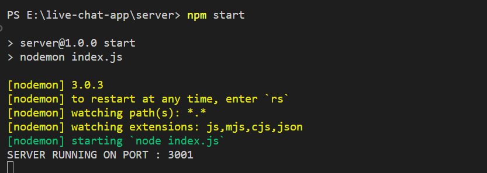

## 1. Open Terminal:

- Press `Windows + R`.

- Type cmd and hit Enter to open the command prompt or click on to ok.

## 2. Navigate to your desired Drive :

for example

- Type `E:` and press Enter to switch to your D drive (or your preferred drive)
  
  

## 3. Clone Repository and Open in VS Code:

- Copy and paste `git clone https://github.com/BhaveshWagh/live-chat-app.git`. press enter
  
- Move into the project folder: `cd live-chat-app`.Hit Enter key
- Open VS Code for the project: `code .` . Hit Enter key
- Note Don't forgot to add "." after code  
  
  

## 4. Set Up Server:

- Open vs code terminal using `ctrl + ~` .
  

- In the VS Code Terminal, go to the server folder: `cd server`. press enter

- Install server dependencies: `npm install`. press enter

## 5. Open Another Terminal for Client:

- In VS Code, open a new terminal.

- Click on to the right side + sign it will open another new terminal

## 6. Navigate to Client Directory &Set Up Client:

- Go to the client folder: `cd client`.

- Install client dependencies: `npm install`.

After successfully install all the dependencies start server and client means your react app is running on to the `http://localhost:3000`

- Start the server: `npm start`. press enter

Now your backend running on the port 3001

- run your react app
- Start the client: `npm start`.

after successfully compiled just open your chrome or it is already open if not then open it and copy the Local : http://localhost:3000 and paste it.

### Simply Type your name into input field and hit start chatting button.

